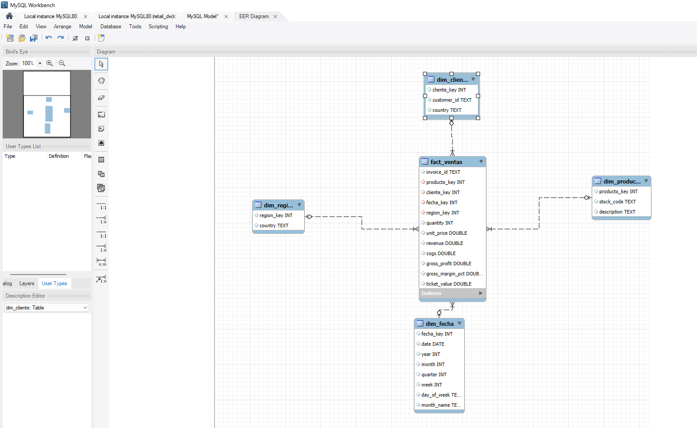
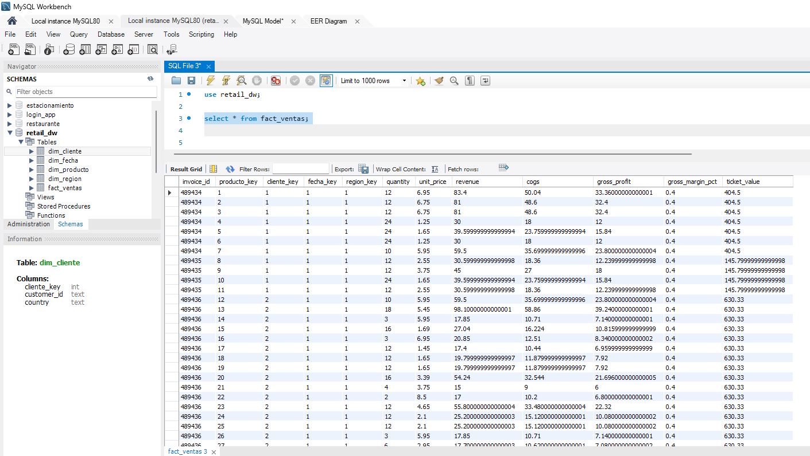
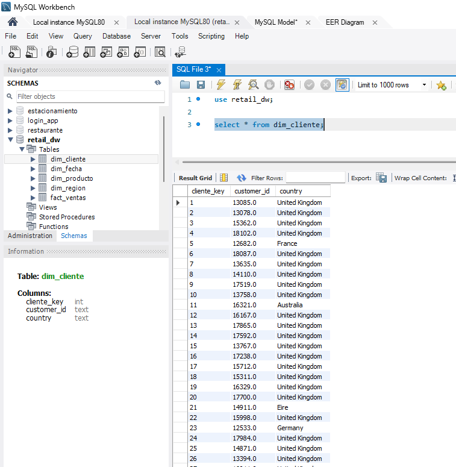
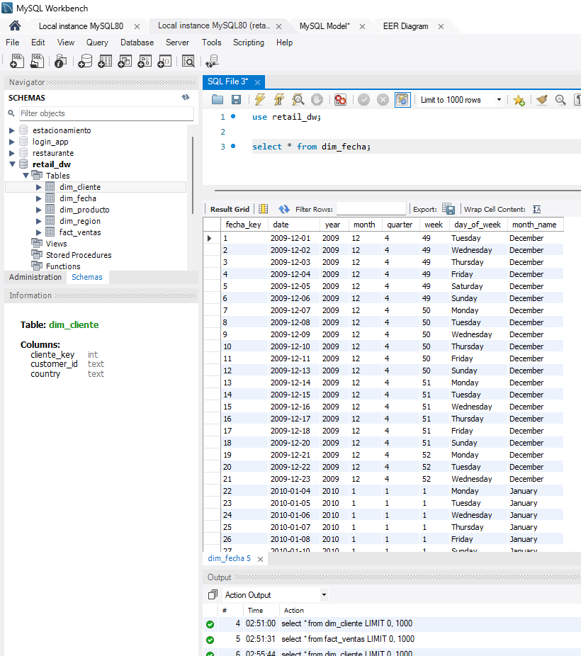
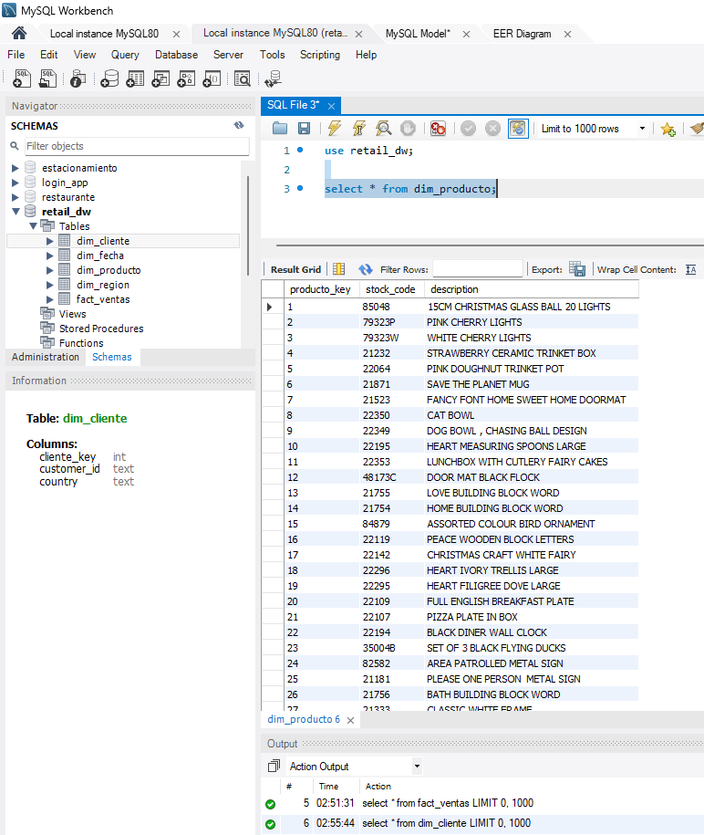
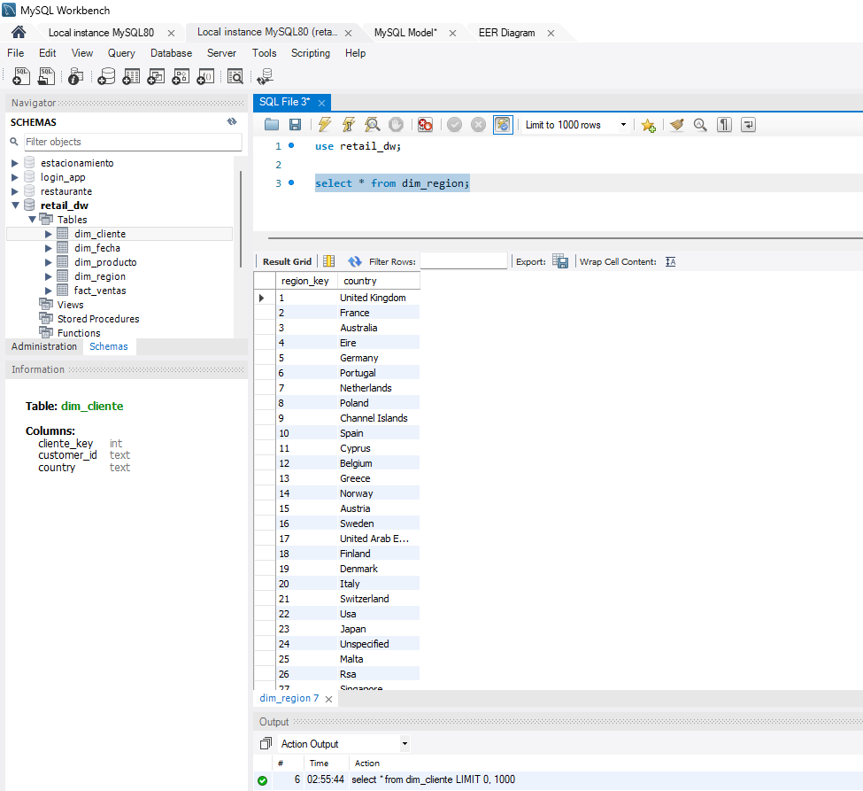
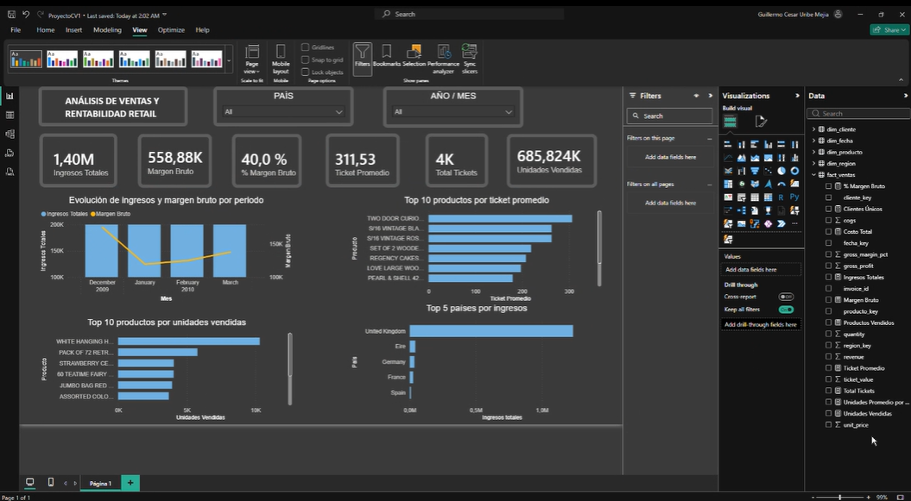

# Análisis-de-ventas-y-rentabilidad
Dashboard de Ventas y Rentabilidad Retail. Proyecto BI End-to-End: procesamiento de +100k transacciones usando Python (ETL), SQL (modelo de datos en Esquema Estrella) y Power BI (KPIs dinámicos de negocio).

# Dashboard de Análisis de Ventas y Rentabilidad Retail

Proyecto de *Business Intelligence* desarrollado a partir de un dataset retail de Kaggle/UCI con más de 100,000 transacciones. El objetivo principal es transformar datos crudos de ventas en un modelo dimensional listo para análisis, permitiendo visualizar KPIs comerciales y operativos en Power BI.

El flujo completo incluye extracción de datos, limpieza, normalización, ingeniería de características, construcción de un modelo estrella, carga a base de datos y desarrollo de un dashboard interactivo.

---

## Objetivo del proyecto

Diseñar e implementar un flujo de análisis de ventas retail que permita:

- Automatizar el procesamiento de datos transaccionales.
- Construir un modelo estrella para análisis dimensional.
- Calcular indicadores clave de negocio.
- Visualizar métricas comerciales en Power BI.
- Reducir el tiempo de análisis manual mediante dashboards interactivos.

---

## Fuente de datos

El proyecto utiliza un dataset público de transacciones retail:

| Elemento | Descripción |
|---|---|
| Dataset | Online Retail II |
| Fuente | Kaggle / UCI Machine Learning Repository |
| Tipo de datos | Transacciones de ventas retail |
| Volumen | Más de 100,000 registros transaccionales |

El dataset contiene información relacionada con facturas, productos, cantidades, precios, clientes, fechas y países.

---

## Tecnologías utilizadas

- Python
- Pandas
- NumPy
- SQLite / MySQL
- SQL
- Power BI
- DAX
- GitHub

---

## Arquitectura del flujo de trabajo

text
Datos crudos
   ↓
ETL en Python
   ↓
DataFrame limpio
   ↓
Modelo estrella SQL
   ↓
Carga a Power BI
   ↓
Dashboard interactivo
   ↓
KPIs y análisis por segmentos

---

## Proceso ETL

El proceso ETL fue desarrollado en Python utilizando Pandas. Su objetivo es convertir los datos crudos en tablas limpias, normalizadas y listas para análisis.

### 1. Carga de datos

Se importa el archivo CSV original y se carga en un DataFrame de Pandas.

python
df = pd.read_csv("online_retail_II.csv")

Durante esta etapa se conservan los identificadores de cliente como texto para evitar errores de formato.

---

### 2. Limpieza de datos

Se aplicaron reglas de limpieza para mejorar la calidad del dataset:

- Estandarización de nombres de columnas.
- Eliminación de registros duplicados.
- Exclusión de devoluciones.
- Eliminación de registros sin identificador de cliente.
- Filtro de cantidades y precios inválidos.
- Tratamiento de outliers extremos mediante IQR.
- Conversión de fechas al formato datetime.

Estas transformaciones permiten trabajar únicamente con transacciones válidas para el análisis comercial.

---

### 3. Normalización

Se normalizaron campos categóricos y de texto para asegurar consistencia en el modelo:

- Descripciones de productos en mayúsculas.
- Limpieza de códigos de producto.
- Eliminación de códigos internos o no comerciales.
- Normalización de nombres de países.
- Limpieza de identificadores de cliente.

---

### 4. Feature Engineering

Se crearon nuevas variables para enriquecer el análisis:

- Revenue / ingresos.
- Costo estimado de venta.
- Gross profit / utilidad bruta.
- Gross margin percentage.
- Año.
- Mes.
- Semana.
- Trimestre.
- Día de la semana.
- Ticket promedio por factura.

> *Nota:* al tratarse de un dataset público sin información directa de costos, se utilizó un margen bruto estimado como supuesto de negocio.

---

## Modelo dimensional

Después del proceso ETL, los datos fueron estructurados bajo un *modelo estrella* para facilitar el análisis en Power BI.

### Tabla de hechos

#### fact_ventas

Contiene las métricas principales de ventas.

| Campo | Descripción |
|---|---|
| invoice_id | Identificador de factura |
| producto_key | Clave del producto |
| cliente_key | Clave del cliente |
| fecha_key | Clave de fecha |
| region_key | Clave de región |
| quantity | Cantidad vendida |
| unit_price | Precio unitario |
| revenue | Ingresos |
| cogs | Costo estimado |
| gross_profit | Utilidad bruta |
| gross_margin_pct | Porcentaje de margen bruto |
| ticket_value | Valor del ticket por factura |

---

### Tablas de dimensión

#### dim_producto

Contiene la información de los productos.

| Campo | Descripción |
|---|---|
| producto_key | Clave única del producto |
| stock_code | Código SKU |
| description | Descripción del producto |

---

#### dim_cliente

Contiene información básica de los clientes.

| Campo | Descripción |
|---|---|
| cliente_key | Clave única del cliente |
| customer_id | Identificador del cliente |
| country | País del cliente |

---

#### dim_fecha

Permite analizar las ventas por diferentes niveles de tiempo.

| Campo | Descripción |
|---|---|
| fecha_key | Clave única de fecha |
| date | Fecha |
| year | Año |
| month | Mes |
| month_name | Nombre del mes |
| quarter | Trimestre |
| week | Semana |
| day_of_week | Día de la semana |

---

#### dim_region

Permite segmentar las ventas por ubicación geográfica.

| Campo | Descripción |
|---|---|
| region_key | Clave única de región |
| country | País |

---

## Base de datos

El modelo dimensional fue exportado a una base de datos para su posterior conexión con Power BI.

El script permite exportar las tablas en:

- Base de datos SQLite.
- Archivos CSV individuales.
- Adaptable a MySQL para entornos de análisis empresarial.

### Tablas generadas

- fact_ventas
- dim_producto
- dim_cliente
- dim_fecha
- dim_region

---

## Capturas de pantalla del modelo SQL / MySQL

### Modelo de base de datos

> Insertar aquí captura del modelo o tablas en MySQL Workbench.

---

### Tabla fact_ventas

> Insertar aquí captura de la tabla fact_ventas.

---

### Tablas dimensionales

> Insertar aquí captura de las tablas dim_producto, dim_fecha, dim_cliente y dim_region.

---

## Carga en Power BI

Las tablas fueron importadas a Power BI para construir el modelo semántico y crear relaciones entre la tabla de hechos y las dimensiones.

### Relaciones principales

- fact_ventas[producto_key] → dim_producto[producto_key]
- fact_ventas[cliente_key] → dim_cliente[cliente_key]
- fact_ventas[fecha_key] → dim_fecha[fecha_key]
- fact_ventas[region_key] → dim_region[region_key]

---

## Dashboard en Power BI

El dashboard permite analizar el desempeño comercial mediante KPIs dinámicos y filtros interactivos.

### Segmentaciones disponibles

- País / región.
- Año.
- Mes.

---

## Captura de pantalla del dashboard Power BI

### Vista general del dashboard

> Insertar aquí captura principal del dashboard.

---

## Resultados obtenidos

El proyecto permitió construir una solución de análisis de datos de extremo a extremo, desde el procesamiento del dataset hasta la visualización ejecutiva.

### Principales logros

- Construcción de un pipeline ETL automatizado en Python.
- Limpieza y normalización de datos transaccionales.
- Creación de variables analíticas para ventas y rentabilidad.
- Diseño de un modelo estrella para análisis dimensional.
- Integración con Power BI.
- Desarrollo de dashboard interactivo con filtros por segmento.
- Reducción estimada del 70% en el tiempo de análisis manual.

---

## Dependencias principales

text
pandas
numpy
sqlite3

> sqlite3 viene incluido por defecto en Python, por lo que no siempre es necesario instalarlo manualmente.

---

## Conclusión

Este proyecto demuestra la implementación de una solución completa de Business Intelligence aplicada al sector retail. A través de Python, SQL y Power BI, se transformaron datos transaccionales en información estratégica para la toma de decisiones.

El resultado final es un dashboard interactivo que permite analizar ventas, rentabilidad, ticket promedio, comportamiento temporal y desempeño por región, reduciendo significativamente el tiempo necesario para generar reportes manuales.

---

## Autores

### Integrante 1

*Nombre:* Carlos Alonso Bazalar  
*Rol:* Data Analyst / Business Intelligence Analyst  
*LinkedIn:* https://www.linkedin.com/in/carlos-alonso-bazalar-cruz-ab2ab1259  
*GitHub:* https://github.com/carlosbazalar17  

### Integrante 2

*Nombre:* Guillermo Cesar Uribe Mejia  
*Rol:* Data Analyst / Business Intelligence Analyst  
*LinkedIn:* https://www.linkedin.com/in/guillermo-uribe/  
*GitHub:* https://github.com/Guille2977
